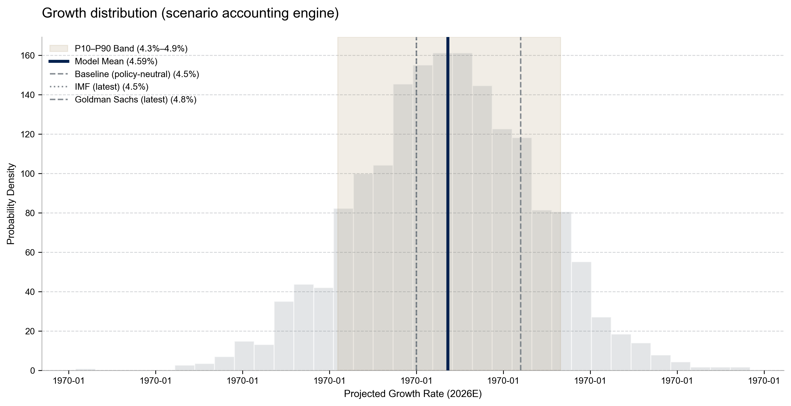
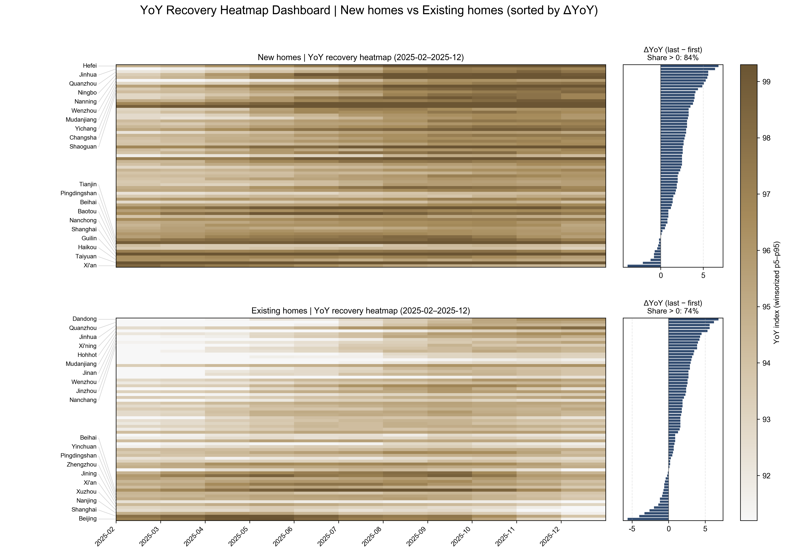
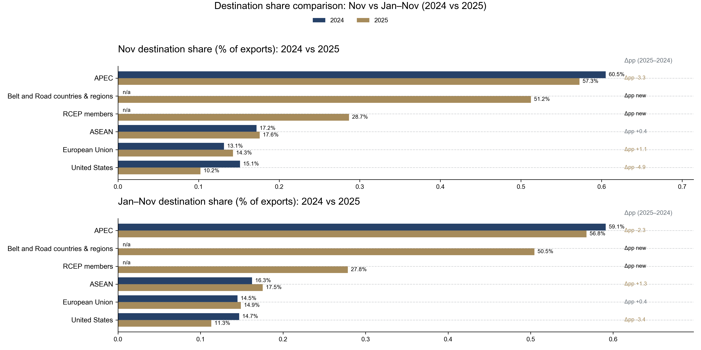

# ChinaMacro2026: Quant-Driven Verification Pipeline

[](https://www.python.org/downloads/)
[](https://opensource.org/licenses/MIT)

### Project Overview
A systematic macro-quant engine designed to verify and challenge sell-side growth narratives (specifically the **Goldman Sachs 2026 China Outlook**). The pipeline utilizes state-dependent lead-lag models and Monte Carlo simulations to quantify **"Transmission Decay"** in China's credit and fiscal impulses.

---

## 📊 Key Visual Insights & Variant Perception

### 1. Growth Probability Distribution (The 28bps Gap)
My Monte Carlo engine shows that the consensus 4.8% target sits at the extreme right tail (**P90**). This suggests the market is pricing in a "perfect" policy transmission that is historically inconsistent with current credit multipliers.


### 2. Property Stabilization Matrix (City-Level Dispersion)
Instead of tracking national averages, I analyze the 70-city price distribution. Our **Stabilization Signal** vs. **Sales Activity** heatmap proves that recovery is fragile and localized, failing to lift the "Left Tail" risk in lower-tier cities.


### 3. Paradigm Shift & Structural Transition
I track the **Paradigm Shift Index (PSI)**—a composite of high-tech vs. legacy manufacturing FAI—to verify if "New Engines" can truly offset the structural drag from the property sector.


### 4. Export Destination Change
I examine the **Export Destination Share** of Chinese leading trading partners to identify the shifting patterns of its export activities behind its trillion-dollar trade surplus.



---

## 🚀 Key Features
* **Variant Perception Engine:** Systematically dissects the 28bps gap between our **4.52% baseline** and institutional consensus.
* **Transmission Multiplier Analysis:** Quantifies the decaying correlation between TSF (Total Social Financing) and IVA (Industrial Value Added).
* **Automated Reporting:** End-to-end pipeline (`run.py`) generating institutional-grade PDF analysis from raw NBS/PBoC/GAC data.

---

## 🛠 Tech Stack & Architecture
* **Engine:** Python (Pandas, NumPy, SciPy, Scikit-learn).
* **Visualization:** Matplotlib & Seaborn (Custom refactored for **Goldman/Bloomberg** professional aesthetics).
* **Design:** Config-driven modularity (`config.yaml`) for seamless task switching between Property, External, and Domestic sectors.
* **Data Source:** Multi-source proprietary dataset manually curated from official Chinese governmental platforms.

---

## ⚙️ Pipeline Execution
To replicate the analysis and regenerate the report:

1. **Install Dependencies:**
   ```bash
   pip install -r requirements.txt

2. **Run Full Pipeline:**
   ```bash
   python -m src.run --config config.yaml

3. **Check Outputs:**
* **Figures:** output/figures/
* **Processed Data:** output/cache/
* **Final Report:** output/reports/China_Macro_2026.pdf

---

## 💡 Investment Implications (The "So What?")

* **Rates (Long 10Y CGB):** My 4.52% baseline implies the PBoC's Reaction Function must shift toward more aggressive easing than currently priced.

* **FX (Short CNY):** The exchange rate will act as the primary Macro Shock Absorber. We see USD/CNY remaining stable in the mid-term.

* **The Machine Thinking:** Credit transmission is now state-dependent on collateral values. Lowering the cost of capital (interest rates) is ineffective if the asset base (property) remains under balance-sheet pressure.

View Full PDF Report | View Methodology Whitepaper
